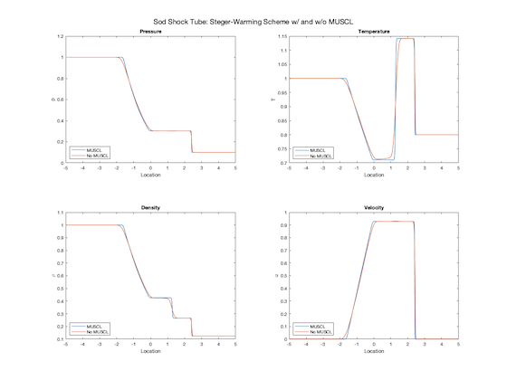
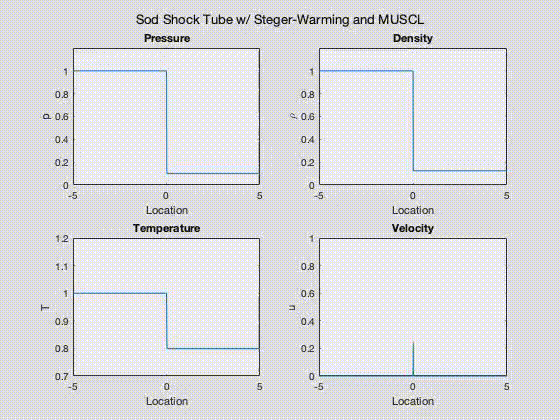

# sod-shock-tube

## Project Description
This project aims to solve the famous Sod Shock Tube problem using the Steger-Warming scheme. 
Two approaches are used, one where the solution at the cell faces are computed using a first-order extrapolation and another using the MUSCL formalism.

## Content
The problem is solved using the following C codes:
1. ```sod_shock_tube.c``` — Steger-Warming without MUSCL
2. ```sod_shock_tube_muscl.c``` — Steger-Warming with MUSCL
3. ```sod_shock_tube_muscl_time.c``` — Steger-Warming with MUSCL and solution at every time-step is stored, so that the solution can be visualized in its evolution with time.

The solution data can be visualized using the following MATLAB scripts:
1. ```plot_sod_shock_tube_muscl.m``` — Plot the solution data with and without MUSCL formalism
2. ```animate_sod_shock_tube_muscl.m``` — Animate the solution data

## Instructions
First compile the C codes — 

```gcc -Wall -o sod_shock_tube sod_shock_tube.c```

```gcc -Wall -o sod_shock_tube_muscl sod_shock_tube_muscl.c```

```gcc -Wall -o sod_shock_tube_muscl_time sod_shock_tube_muscl_time.c```

Next, run the compiled programs — 

```./sod_shock_tube ```

```./sod_shock_tube_muscl```

```./sod_shock_tube_muscl_time```

Now, the data can be visualized using the two MATLAB scripts. Simply fire up MATLAB and run the following scripts —

```plot_sod_shock_tube_muscl.m```

```animate_sod_shock_tube_muscl.m``` 

## Results

### Plot of the Sod Shock Tube solution


### Animation of the Sod Shock Tube solution
